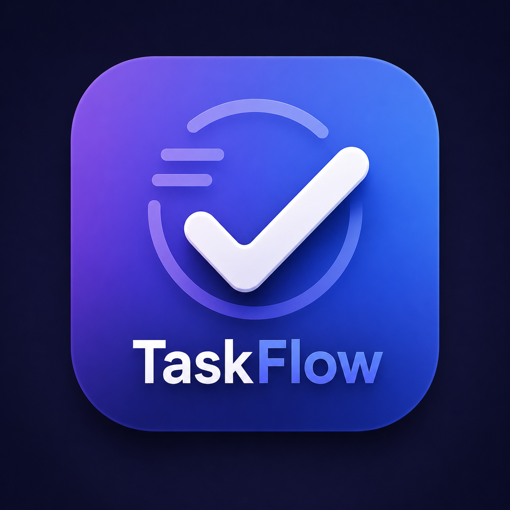

 <div align="center">


# 🚀 TaskFlow

### Modern Full-Stack Task Management Application

A clean and responsive task management application built with **React**, **FastAPI**, and **SQLite**. Manage your daily tasks efficiently with a modern user interface and powerful REST APIs.


</div>


- ✅ Create new tasks
- 📝 Edit existing tasks
- 🗑 Delete tasks
- 📋 View all tasks

- 🔄 Update task status
- 📱 Responsive UI
- ⚡ FastAPI REST API
- ✔ Input validation
- 🚨 Proper error handling
- 📖 Interactive Swagger Documentation

---

# 📸 Screenshots

## Dashboard


## Add Task


## API Documentation


---

# 🛠 Tech Stack

## Frontend

- React.js
- Vite
- Tailwind CSS
- Axios

## Backend

- FastAPI
- SQLAlchemy
- Pydantic
- Uvicorn

## Database

- SQLite

## Tools

- Git
- GitHub
- VS Code

---

# 📂 Project Structure

```text
TaskFlow
│
├── backend
│   ├── app
│   │   ├── config
│   │   ├── database
│   │   ├── models
│   │   ├── routers
│   │   ├── schemas
│   │   ├── services
│   │   ├── utils
│   │   └── main.py
│   │
│   ├── requirements.txt
│   └── .env
│
├── frontend
│   ├── public
│   ├── src
│   └── package.json
│
├── docs
│   ├── logo.png
│   ├── dashboard.png
│   ├── add-task.png
│   └── swagger.png
│
└── README.md
```

---

# 🚀 Getting Started

## Clone Repository

```bash
git clone https://github.com/YOUR_USERNAME/TaskFlow.git

cd TaskFlow
```

---

# Backend Setup

```bash
cd backend

python -m venv .venv
```

### Activate Virtual Environment

Windows

```bash
.venv\Scripts\activate
```

Linux / macOS

```bash
source .venv/bin/activate
```

### Install Dependencies

```bash
pip install -r requirements.txt
```

### Run Backend

```bash
uvicorn app.main:app --reload
```

Backend URL

```
http://localhost:8000
```

Swagger API Docs

```
http://localhost:8000/docs
```

---

# Frontend Setup

```bash
cd frontend

npm install

npm run dev
```

Frontend URL

```
http://localhost:5173
```

---

# 📌 API Endpoints

| Method | Endpoint | Description |
|---------|----------|-------------|
| GET | `/api/tasks` | Get all tasks |
| GET | `/api/tasks/{id}` | Get task by ID |
| POST | `/api/tasks` | Create task |
| PUT | `/api/tasks/{id}` | Update task |
| DELETE | `/api/tasks/{id}` | Delete task |

---

# 🗃 Task Model

| Field | Type | Required |
|---------|------|----------|
| id | Integer | Auto Generated |
| title | String | ✅ |
| description | String | Optional |
| status | pending / in-progress / completed | ✅ |
| createdAt | DateTime | Auto Generated |
| updatedAt | DateTime | Auto Updated |

---

# 💡 Technical Decisions

### FastAPI

- High-performance backend
- Automatic Swagger documentation
- Built-in request validation
- Easy REST API development

### React

- Component-based architecture
- Fast development with Vite
- Reusable UI components

### SQLite

- Lightweight
- No additional server setup
- Ideal for development and take-home assignments

### Layered Architecture

The backend follows a layered architecture:

```
Client
   ↓
Routers
   ↓
Services
   ↓
Database
```

This separation improves maintainability and scalability.

---

# ✅ Validation & Error Handling

- Required field validation
- Invalid status validation
- Meaningful error messages
- Proper HTTP status codes

| Status Code | Meaning |
|--------------|---------|
| 200 | Success |
| 201 | Created |
| 400 | Bad Request |
| 404 | Task Not Found |
| 500 | Internal Server Error |

---

# 🚀 Future Improvements

- User Authentication
- Task Categories
- Search & Filters
- Due Dates
- Notifications
- Docker Support
- Unit Testing
- CI/CD Pipeline

---

# 📜 License

This project was developed as part of a Full-Stack Developer technical assessment.

---

<div align="center">

### ⭐ If you found this project helpful, consider giving it a star!

Made with ❤️ by **Akshat Bhardwaj**

[GitHub](https://github.com/AKSHAT-BHARDWAJ01) • [LinkedIn](https://www.linkedin.com/in/akshat-bhardwaj-84bb52271/)

</div>
